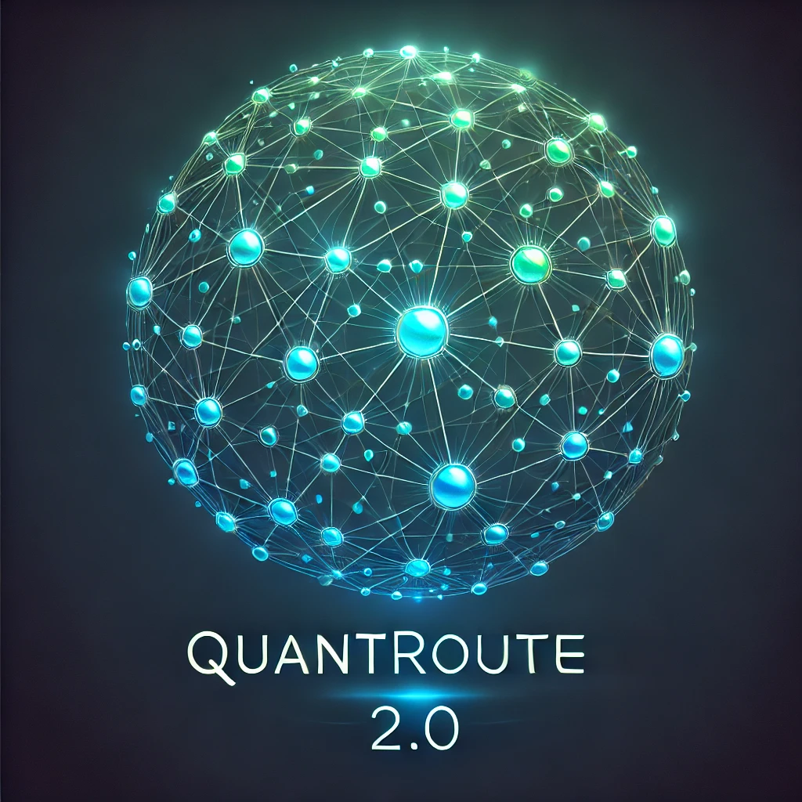

# QuantaRoute2.0

<p align="center">
  
</p>

QuantaRoute2.0 is an advanced Python-based simulator for quantum networks that builds upon the initial QuantaRoute tool. It extends the simulation capabilities to assess routing performance in regular and random topologies while incorporating a robust grey‐box approach for quantum routing that does not require detailed per‐node/per‐link information. This version integrates enhanced modelling of heterogeneous nodes, sophisticated routing algorithms, and extensive performance metrics to enable realistic evaluation of end‐to‐end fidelity in quantum networks.

## Features

- **Robust Grey-Box Routing:**  
  QuantaRoute2.0 leverages a novel grey-box approach for routing in quantum networks. Instead of relying on detailed information about each node or link, the tool uses end-to-end fidelity measurements to guide path selection, thus reducing the need for full internal network knowledge.

- **Dynamic Routing Algorithms:**  
  The simulator implements multiple routing strategies including:
  - **Shortest Path (SP):** Basic Dijkstra-based routing.
  - **Knowledge-Aware (KA):** A white-box approach that uses node-specific efficiency figures.
  - **k-Shortest Path (KSP):** Selects the best path out of the first *k* shortest paths based on end-to-end fidelity.
  - **kx Path-Selection:** A restrictive grey-box algorithm (e.g., kx0, kx1) that limits the allowed deviation from the shortest possible path to optimise resource utilisation and reduce blocking probability.

- **Network Topologies:**  
  Evaluate routing performance on:
  - **Regular Topologies:** Grid-based structures representing controlled, intra-domain network.
  - **Random Topologies:** Generated via the Waxman model to simulate more realistic and diverse network environments.

- **Comprehensive Performance Metrics:**  
  The simulator gathers key performance indicators such as:
  - **End-to-End Fidelity:** Measurement of the quality of quantum entanglement over the selected path.
  - **Blocking Probability:** The likelihood of a connection request being denied due to resource constraints.
  - **Fairness:** Assessed through Jain's fairness index to ensure equitable resource allocation among source-destination pairs.
  - **Path Establishment Order and Resource Utilisation:** Analysis of how the order of serving requests affects network performance.

- **Monte Carlo Simulations:**  
  Randomised evaluations over multiple iterations ensure that the performance metrics are robust and account for the stochastic nature of quantum entanglement processes.
  
## References
- **Published version:** Kumar, V., et al.: Routing in quantum networks with end‐to‐end knowledge. IET Quant. Comm. e70000 (2025). https://doi.org/10.1049/qtc2.70000
- **Preprint:** Kumar, Vinay, et al. "Routing in Quantum Networks with End-to-End Knowledge." arXiv e-prints (2024): arXiv-2407.
- **Initial Version:** The initial version of QuantaRoute is available at https://github.com/vk9696/quantum-routing1.

  ## Installation

To get started with QuantaRoute2.0, follow these simple installation instructions:

1. **Clone the repository:**
```sh
git clone https://github.com/vk9696/quantum-routing1.git
```

2. **Navigate to the QuantaRoute directory:**
```sh
cd quantum-routing2
```

3. **Install the required dependencies:**
```sh
pip install -r requirements.txt
```
